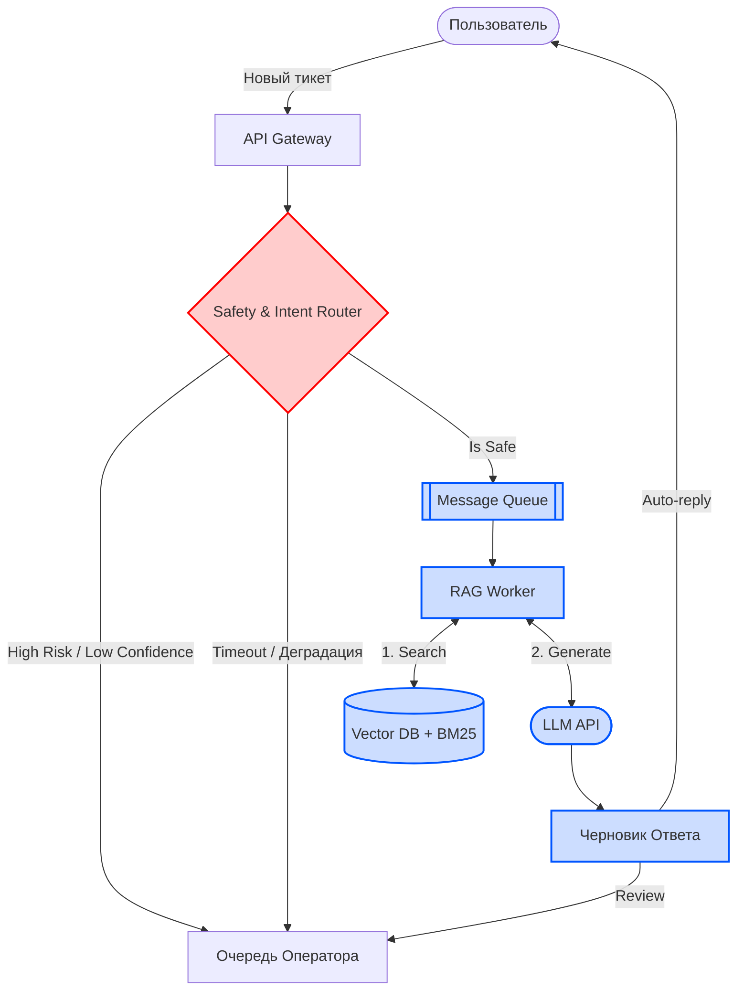

# Целевая архитектура AI-поддержки

## Основные компоненты и поток данных
Целевая система построена на микросервисной архитектуре и разделена на два контура для обеспечения баланса между скоростью, стоимостью и качеством.

1. **API Gateway / Webhook Receiver:** Принимает входящие тикеты из всех каналов (чат, email, web).
2. **Safety & Intent Router (Синхронно):** Легковесный сервис классификации. Проверяет текст на наличие рисков (угрозы, суд) и определяет тему обращения. Отрабатывает менее чем за 500 мс.
3. **Message Queue (Асинхронно):** Очередь задач (например, Kafka или RabbitMQ) для сглаживания пиковых нагрузок (всплесков до 20k тикетов).
4. **RAG Worker (Асинхронно):** Воркер, извлекающий релевантный контекст и обращающийся к LLM для генерации ответа.
5. **Operator Workspace (UI):** Интерфейс оператора для ручного разбора эскалированных и рискованных тикетов.

## Синхронные и асинхронные части
- **Синхронная часть (Hot Path):** Первичная классификация и маршрутизация. Критична для SLA. Если тикет опасный, он *сразу* уходит на оператора без ожидания ответа от тяжелых моделей.
- **Асинхронная часть (Cold Path):** Поиск по базе знаний, извлечение эмбеддингов, генерация ответа через внешний LLM API. Позволяет системе не падать при всплесках нагрузки.

## Хранилища и интеграции
- **Векторная БД (FAISS / Chroma / Milvus):** Хранение эмбеддингов базы знаний и прошлых успешных тикетов.
- **Relational DB (PostgreSQL):** Хранение самих тикетов, логов решений (audit trail) и текстов базы знаний.
- **Интеграции:** Внешний LLM API (YandexGPT, OpenAI или аналог).

## Запасные пути (Fallbacks) и Human-in-the-loop (HITL)
При недоступности LLM API, падении векторной базы или низкой уверенности классификатора (`confidence < threshold`), система graceful-деградирует: все тикеты маршрутизируются напрямую на операторов, как если бы AI не существовало.

## Диаграмма потока (Mermaid)

